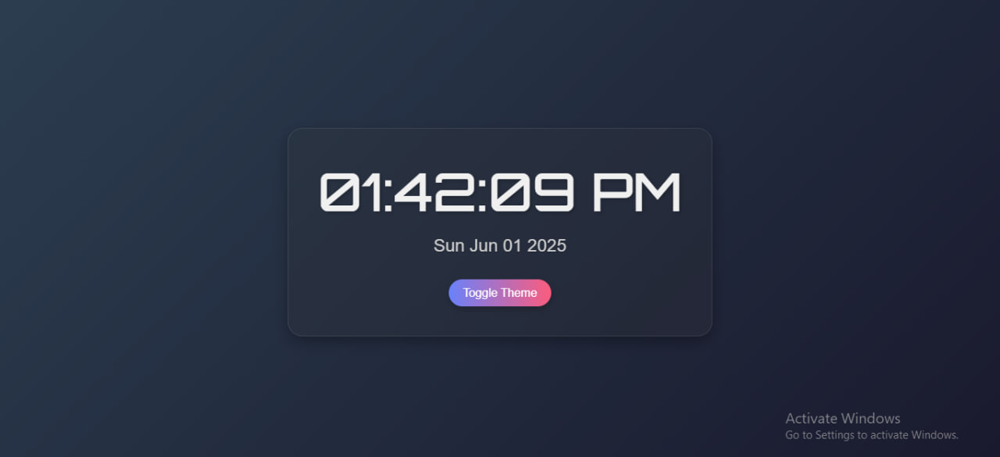
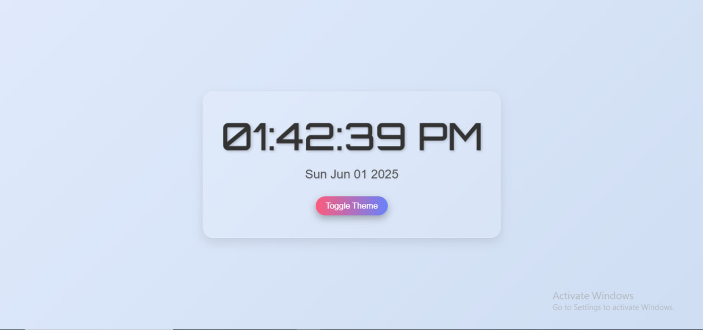

Digital Clock ⏰
A simple and stylish digital clock built with HTML, CSS, and JavaScript. It displays the current time and date, supports light and dark themes, and includes a subtle ticking sound effect for an immersive experience.
Features
Displays the current time in 12-hour format (e.g., 01:20:43 PM).
Shows the current date (e.g., Sun Jun 01 2025).
Toggle between light and dark themes with persistence using localStorage.
Responsive design that adapts to different screen sizes.
Subtle animations for clock updates and theme toggle.
Optional ticking sound effect (requires a tick.mp3 file).
Demo

The clock at 01:20:43 PM on Sun Jun 01 2025.
Installation
Clone or download this repository to your local machine:
bash
git clone https://github.com/ozi-Shalom2333/digitalclock.git
Navigate to the project directory:
bash
cd digitalclock
Open the index.html file in your preferred web browser:
bash
open index.html
Alternatively, you can use a local development server (e.g., with VS Code's Live Server extension) for a better experience.
Usage
The clock automatically displays the current time and date upon loading.
Click the "Toggle Theme" button to switch between light and dark modes. The theme preference is saved in localStorage and persists across page reloads.
If the tick.mp3 file is present in the project directory, a ticking sound will play every second. Ensure the file is correctly placed, or the sound will be skipped.
Project Structure
digitalclock/
│
├── index.html       # Main HTML file
├── style.css        # Styles for the clock
├── script.js        # JavaScript logic for clock functionality
├── tick.wav         # Optional audio file for ticking sound (not included)
└── README.md        # Project documentation
Technologies Used
HTML5: Structure of the clock.
CSS3: Styling with container queries for responsiveness, animations, and glassmorphism effects.
JavaScript: Logic for updating the time, date, and theme toggle.
Google Fonts: 'Orbitron' for the clock and 'Roboto' for the date.
localStorage: Persisting theme preference.
Styling Highlights
Gradient background for a modern look.
Glassmorphism effect for the clock container.
Smooth animations for clock updates and theme toggle.
Responsive design using container queries.
Notes
Ensure the tick.wav file is added to the project directory if you want the ticking sound effect. Without it, the audio playback will silently fail.
The clock uses the client's system time, so ensure your device's time settings are accurate.
Tested on modern browsers (Chrome, Firefox, Edge). Some features (like backdrop-filter) may not work on older browsers.
Contributing
Feel free to fork this repository, make improvements, and submit a pull request. Suggestions for new features or bug fixes are welcome!
